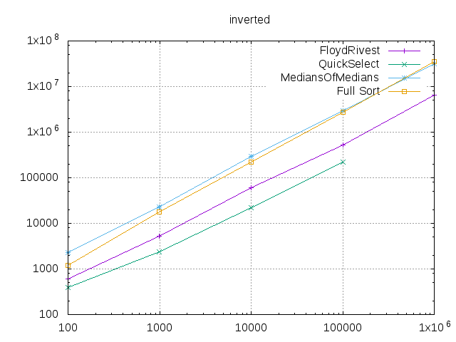
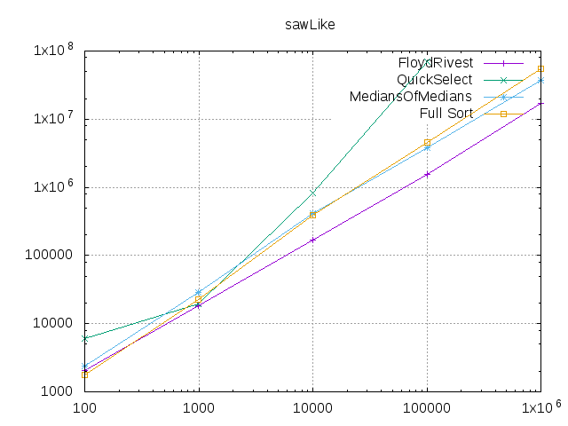

## nth_element

Golang implementation of [selection algorithm](https://en.wikipedia.org/wiki/Selection_algorithm).

Selection algorithm is a partial sorting algorithm that rearranges elements such that if elements [first, last) 
were sorted, then the element at given nth position coincides. All elements in position i < n satisfy a[i] <= a[n].
All elements in position i > n satisfy a[i] >= a[n].

Currently his library implements the [Floyd Rivest](https://en.wikipedia.org/wiki/Floyd%E2%80%93Rivest_algorithm) algorithm.

### Installation

    go get github.com/furstenheim/nth_element

### Import

    import (
        "github.com/furstenheim/nth_element/FloydRivest"
    )

### Methods

    s := // some slice
    FloydRivest.Buckets(sort.Interface(s), 5)

    // s is now sorted into buckets of size 5
    // max(s[0:5]) < min(s[5:10])
    // max(s[10: 15]) < min(s[15:20])
    // ...

### Benchmark

All benchmarks can be found [here](./benchmark.md)

This is a comparison with plain sort for selection of median, when array is decending order.

 
 
 This is a comparison when array is in saw mode (a[i] = i % 10)

### Acknowldegment
The library is based on the insight from [Mourner](https://github.com/mourner/rbush/blob/master/index.js#L547) that Floyd-Rivest performs better than plain sort
